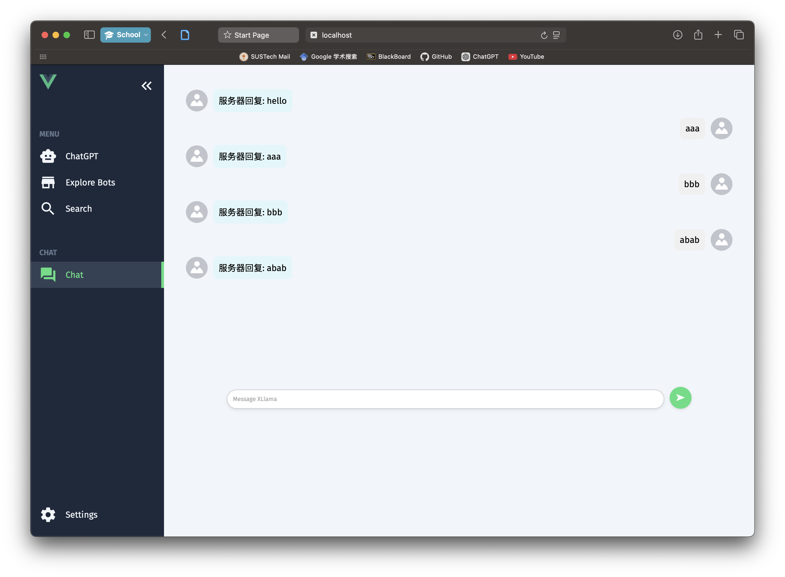
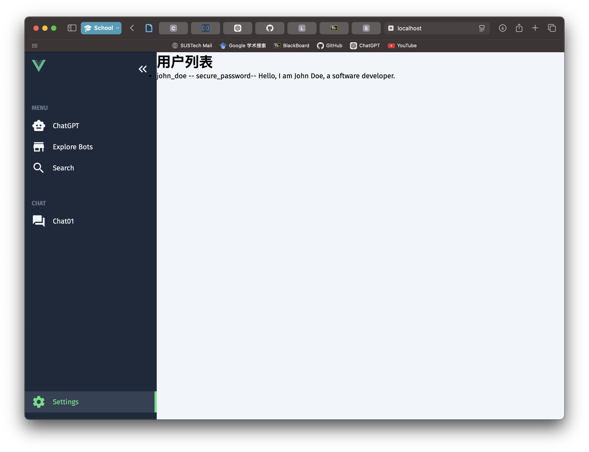
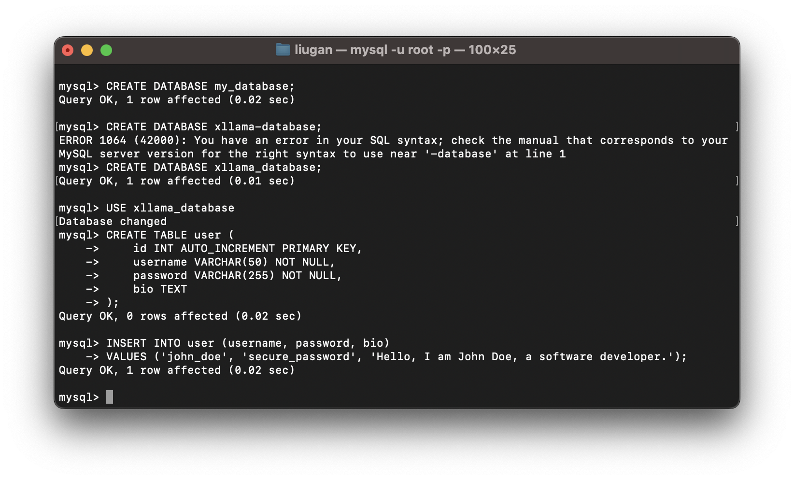
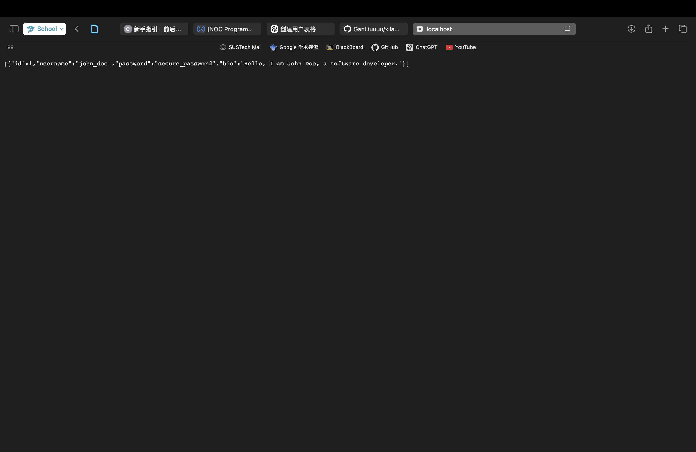

# 🦙 X Llama: A LLM-Powered AI com.example.xllamaserver.Bot Platform


## 开发中的模块：

### 聊天模块

目前已经实现了基本的前后端交互功能，使用了 Spring Boot、Vue 和 WebSocket 技术。在 Vue 中，通过监听服务器返回的信息，实时将 HTML 元素添加到页面上。当用户发送消息时，会通过 `websocket.send` 将信息传递到服务器，服务器则通过 `onmessage` 函数感知并处理该消息。为了初步展示功能，现在服务端会将用户发送的任何消息原样回复至该用户的 session。用户可以点击侧边栏的“Chat”按钮进行交互。与大模型交互的基础部分将由 [Artanisax](https://github.com/Artanisax) 负责开发。



### 用户模块

该模块展示了前端如何查询后端数据库，使用 Axios 实现了数据请求，并在 `CorsConfig` 中进行了跨域配置，确保可以跨域访问。文档中提供了从创建数据库到运行程序的详细教程。用户数据的存储方式尚需负责该模块的同学进一步设计与实现。访问数据库效果如下图：



## How to run the project

### Server

本项目采用 Spring Boot + Vue 前后端分离的架构，Spring Boot 负责处理后端逻辑并与 MySQL 数据库交互。该部分对后端部分进行说明，并提供开发指引。

#### Quick Start(Server)

在本地下载并配置 MySQL，将初始密码设置为 `xllama123`。配置完成后，使用命令行或可视化工具（如 Navicat）创建数据库和表。

##### 1. 创建数据库

使用以下 SQL 语句创建数据库：

```sql
CREATE DATABASE xllama_database;
```

##### 2. 选择数据库

创建数据库后，使用以下语句选择你刚创建的数据库：

```sql
USE xllama_database;
```

##### 3. 创建表

使用以下 SQL 语句在数据库中创建 `user` 表：

```sql
CREATE TABLE user (
    id INT AUTO_INCREMENT PRIMARY KEY,
    username VARCHAR(50) NOT NULL,
    password VARCHAR(255) NOT NULL,
    bio TEXT
);
```

##### 4. 插入测试数据

在 `user` 表中插入一条测试数据，方便后续测试：

```sql
INSERT INTO user (username, password, bio) 
VALUES ('john_doe', 'secure_password', 'Hello, I am John Doe, a software developer.');
```

所有操作如下图所示：



##### 5. 运行后端程序

```
git clone https://github.com/GanLiuuuu/xllama-server.git
```

Clone 后端代码并在 IDE 中打开。成功启动项目后，访问 `localhost:8081/user/getAll`，你应该能够看到之前插入的测试数据，如下图所示：



如遇到依赖问题，请在群里讨论。

### Client

The client is built using Vue, with axios added as a dependency for data transmission between the front-end and back-end.

Install dependencies:

```
npm i
```

Run the client:

```
npm run dev
```

### Server + Client Integration

After completing all the previous steps (primarily setting up the MySQL database), the general development workflow is as follows:

```
git clone https://github.com/GanLiuuuu/xllama-client.git
git clone https://github.com/GanLiuuuu/xllama-server.git
```

Open the server in your IDE and run it.

Then run the client:

```
cd xllama-client
npm i
npm run dev
```

Once the front-end and back-end are connected successfully, click on "Settings" in the interface. You should see the data you inserted into the database, completing the front-end and back-end integration. It should look like this:
